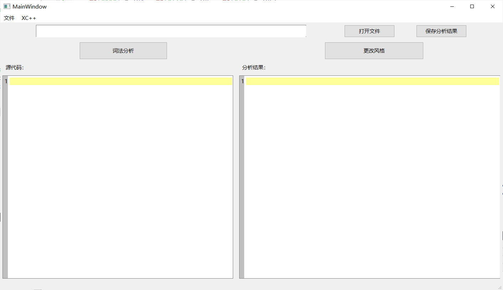
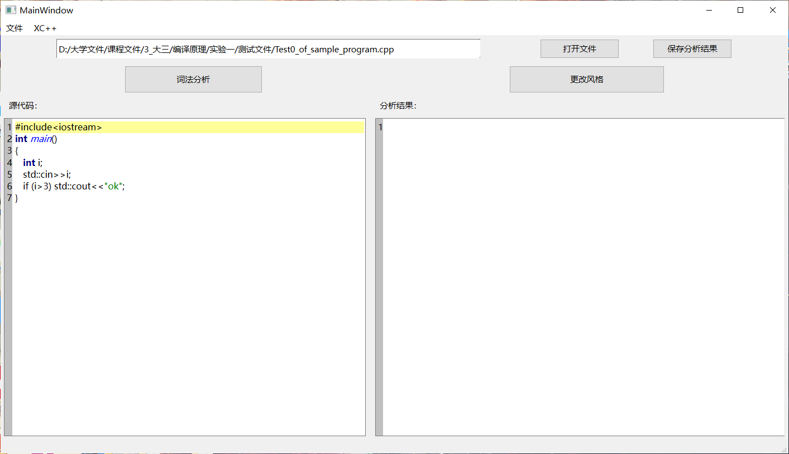
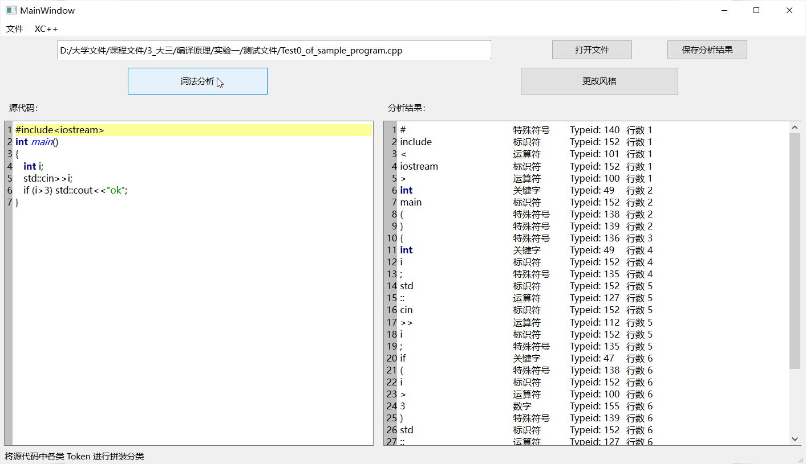

双击文件夹内exe文件，打开界面

    
     
    
图1. 程序开始界面

点击打开文件按钮

    
     
    
图2. 打开文件

打开文件后

    
     
    
图3. 打开文件后效果

点击词法分析

    
     
    
图4. 点击词法分析

点击更改风格

    
     
    
图5. 更改为XC++风格

点击菜单栏 - XC++ - 风格说明

    
     
    
图6. 显示替换方案

