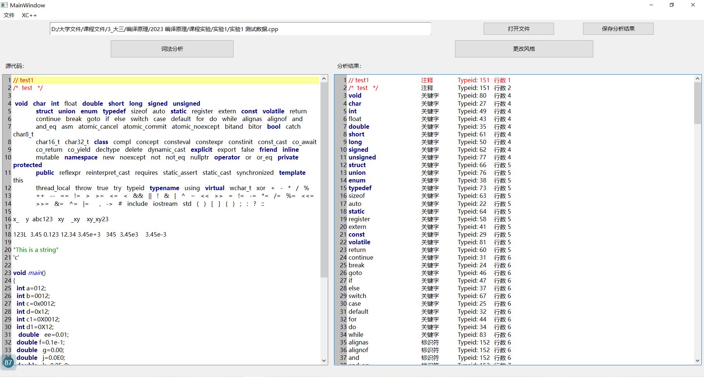
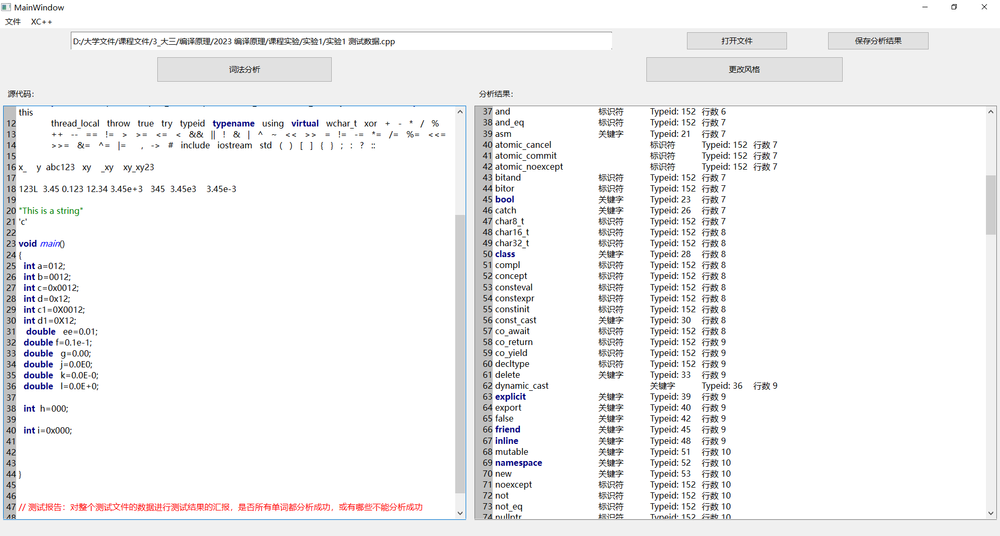
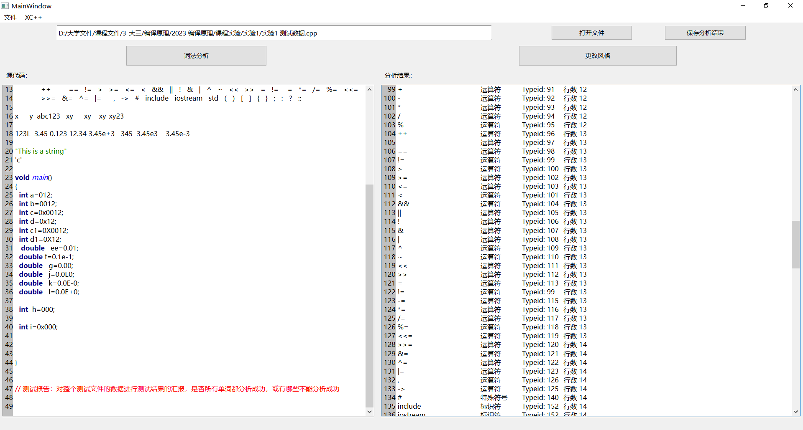
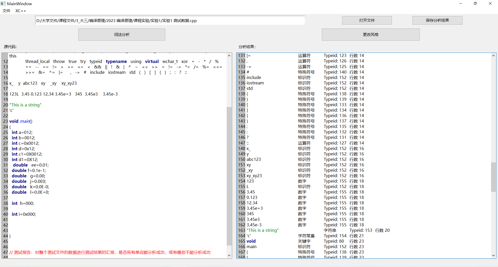

# 测试报告

## 运行结果及分析

部分分析结果截图：









由分析结果截图可以看出，本程序把部分关键字识别成了标识符，如alignas，and_eq，atomic_noexcept，concept等，但c++中常见的关键字基本能识别出来。本程序能成功识别全部运算符与特殊符号（见附录99行），但是把include, iostream, std识别成了标识符（见附录135~137行）。

程序能成功识别测试文件中的全部标识符（见附录148~153行），以及大部分的数字包括十六进制数、八进制数、科学计数法以及带符号数，除了数字 `123L` （见附录154行），程序将该数字识别成了数字123与标识符L。对于字符串与字符常量，程序也能正常识别（见附录163~164行）。

<div style="page-break-after:always;">
</div>

## 附录

完整分析结果如下：

```
// test1		注释	Typeid: 151	行数 1
/*  test   */		注释	Typeid: 151	行数 2
void		关键字	Typeid: 80	行数 4
char		关键字	Typeid: 27	行数 4
int		关键字	Typeid: 49	行数 4
float		关键字	Typeid: 43	行数 4
double		关键字	Typeid: 35	行数 4
short		关键字	Typeid: 61	行数 4
long		关键字	Typeid: 50	行数 4
signed		关键字	Typeid: 62	行数 4
unsigned		关键字	Typeid: 77	行数 4
struct		关键字	Typeid: 66	行数 5
union		关键字	Typeid: 76	行数 5
enum		关键字	Typeid: 38	行数 5
typedef		关键字	Typeid: 73	行数 5
sizeof		关键字	Typeid: 63	行数 5
auto		关键字	Typeid: 22	行数 5
static		关键字	Typeid: 64	行数 5
register		关键字	Typeid: 58	行数 5
extern		关键字	Typeid: 41	行数 5
const		关键字	Typeid: 29	行数 5
volatile		关键字	Typeid: 81	行数 5
return		关键字	Typeid: 60	行数 5
continue		关键字	Typeid: 31	行数 6
break		关键字	Typeid: 24	行数 6
goto		关键字	Typeid: 46	行数 6
if		关键字	Typeid: 47	行数 6
else		关键字	Typeid: 37	行数 6
switch		关键字	Typeid: 67	行数 6
case		关键字	Typeid: 25	行数 6
default		关键字	Typeid: 32	行数 6
for		关键字	Typeid: 44	行数 6
do		关键字	Typeid: 34	行数 6
while		关键字	Typeid: 83	行数 6
alignas		标识符	Typeid: 152	行数 6
alignof		标识符	Typeid: 152	行数 6
and		标识符	Typeid: 152	行数 6
and_eq		标识符	Typeid: 152	行数 7
asm		关键字	Typeid: 21	行数 7
atomic_cancel		标识符	Typeid: 152	行数 7
atomic_commit		标识符	Typeid: 152	行数 7
atomic_noexcept		标识符	Typeid: 152	行数 7
bitand		标识符	Typeid: 152	行数 7
bitor		标识符	Typeid: 152	行数 7
bool		关键字	Typeid: 23	行数 7
catch		关键字	Typeid: 26	行数 7
char8_t		标识符	Typeid: 152	行数 7
char16_t		标识符	Typeid: 152	行数 8
char32_t		标识符	Typeid: 152	行数 8
class		关键字	Typeid: 28	行数 8
compl		标识符	Typeid: 152	行数 8
concept		标识符	Typeid: 152	行数 8
consteval		标识符	Typeid: 152	行数 8
constexpr		标识符	Typeid: 152	行数 8
constinit		标识符	Typeid: 152	行数 8
const_cast		关键字	Typeid: 30	行数 8
co_await		标识符	Typeid: 152	行数 8
co_return		标识符	Typeid: 152	行数 9
co_yield		标识符	Typeid: 152	行数 9
decltype		标识符	Typeid: 152	行数 9
delete		关键字	Typeid: 33	行数 9
dynamic_cast		关键字	Typeid: 36	行数 9
explicit		关键字	Typeid: 39	行数 9
export		关键字	Typeid: 40	行数 9
false		关键字	Typeid: 42	行数 9
friend		关键字	Typeid: 45	行数 9
inline		关键字	Typeid: 48	行数 9
mutable		关键字	Typeid: 51	行数 10
namespace		关键字	Typeid: 52	行数 10
new		关键字	Typeid: 53	行数 10
noexcept		标识符	Typeid: 152	行数 10
not		标识符	Typeid: 152	行数 10
not_eq		标识符	Typeid: 152	行数 10
nullptr		标识符	Typeid: 152	行数 10
operator		关键字	Typeid: 54	行数 10
or		标识符	Typeid: 152	行数 10
or_eq		标识符	Typeid: 152	行数 10
private		关键字	Typeid: 55	行数 10
protected		关键字	Typeid: 56	行数 10
public		关键字	Typeid: 57	行数 11
reflexpr		标识符	Typeid: 152	行数 11
reinterpret_cast		关键字	Typeid: 59	行数 11
requires		标识符	Typeid: 152	行数 11
static_assert		标识符	Typeid: 152	行数 11
static_cast		关键字	Typeid: 65	行数 11
synchronized		标识符	Typeid: 152	行数 11
template		关键字	Typeid: 68	行数 11
this		关键字	Typeid: 69	行数 11
thread_local		标识符	Typeid: 152	行数 12
throw		关键字	Typeid: 70	行数 12
true		关键字	Typeid: 71	行数 12
try		关键字	Typeid: 72	行数 12
typeid		关键字	Typeid: 74	行数 12
typename		关键字	Typeid: 75	行数 12
using		关键字	Typeid: 78	行数 12
virtual		关键字	Typeid: 79	行数 12
wchar_t		关键字	Typeid: 82	行数 12
xor		标识符	Typeid: 152	行数 12
+		运算符	Typeid: 91	行数 12
-		运算符	Typeid: 92	行数 12
*		运算符	Typeid: 93	行数 12
/		运算符	Typeid: 94	行数 12
%		运算符	Typeid: 95	行数 12
++		运算符	Typeid: 96	行数 13
--		运算符	Typeid: 97	行数 13
==		运算符	Typeid: 98	行数 13
!=		运算符	Typeid: 99	行数 13
>		运算符	Typeid: 100	行数 13
>=		运算符	Typeid: 102	行数 13
<=		运算符	Typeid: 103	行数 13
<		运算符	Typeid: 101	行数 13
&&		运算符	Typeid: 104	行数 13
||		运算符	Typeid: 105	行数 13
!		运算符	Typeid: 106	行数 13
&		运算符	Typeid: 107	行数 13
|		运算符	Typeid: 108	行数 13
^		运算符	Typeid: 109	行数 13
~		运算符	Typeid: 110	行数 13
<<		运算符	Typeid: 111	行数 13
>>		运算符	Typeid: 112	行数 13
=		运算符	Typeid: 113	行数 13
!=		运算符	Typeid: 99	行数 13
-=		运算符	Typeid: 115	行数 13
*=		运算符	Typeid: 116	行数 13
/=		运算符	Typeid: 117	行数 13
%=		运算符	Typeid: 118	行数 13
<<=		运算符	Typeid: 119	行数 13
>>=		运算符	Typeid: 120	行数 14
&=		运算符	Typeid: 121	行数 14
^=		运算符	Typeid: 122	行数 14
|=		运算符	Typeid: 123	行数 14
,		运算符	Typeid: 126	行数 14
->		运算符	Typeid: 125	行数 14
#		特殊符号	Typeid: 140	行数 14
include		标识符	Typeid: 152	行数 14
iostream		标识符	Typeid: 152	行数 14
std		标识符	Typeid: 152	行数 14
(		特殊符号	Typeid: 138	行数 14
)		特殊符号	Typeid: 139	行数 14
[		特殊符号	Typeid: 133	行数 14
]		特殊符号	Typeid: 134	行数 14
{		特殊符号	Typeid: 136	行数 14
}		特殊符号	Typeid: 137	行数 14
;		特殊符号	Typeid: 135	行数 14
:		特殊符号	Typeid: 132	行数 14
?		特殊符号	Typeid: 131	行数 14
::		运算符	Typeid: 127	行数 14
x_		标识符	Typeid: 152	行数 16
y		标识符	Typeid: 152	行数 16
abc123		标识符	Typeid: 152	行数 16
xy		标识符	Typeid: 152	行数 16
_xy		标识符	Typeid: 152	行数 16
xy_xy23		标识符	Typeid: 152	行数 16
123		数字	Typeid: 155	行数 18
L		标识符	Typeid: 152	行数 18
3.45 		数字	Typeid: 155	行数 18
0.123 		数字	Typeid: 155	行数 18
12.34 		数字	Typeid: 155	行数 18
3.45e+3   		数字	Typeid: 155	行数 18
345  		数字	Typeid: 155	行数 18
3.45e3    		数字	Typeid: 155	行数 18
3.45e-3		数字	Typeid: 155	行数 18
"This is a string"		字符串	Typeid: 153	行数 20
'c'		字符常量	Typeid: 154	行数 21
void		关键字	Typeid: 80	行数 23
main		标识符	Typeid: 152	行数 23
(		特殊符号	Typeid: 138	行数 23
)		特殊符号	Typeid: 139	行数 23
{		特殊符号	Typeid: 136	行数 24
int		关键字	Typeid: 49	行数 25
a		标识符	Typeid: 152	行数 25
=		运算符	Typeid: 113	行数 25
012		数字	Typeid: 155	行数 25
;		特殊符号	Typeid: 135	行数 25
int		关键字	Typeid: 49	行数 26
b		标识符	Typeid: 152	行数 26
=		运算符	Typeid: 113	行数 26
0012		数字	Typeid: 155	行数 26
;		特殊符号	Typeid: 135	行数 26
int		关键字	Typeid: 49	行数 27
c		标识符	Typeid: 152	行数 27
=		运算符	Typeid: 113	行数 27
0x0012		数字	Typeid: 155	行数 27
;		特殊符号	Typeid: 135	行数 27
int		关键字	Typeid: 49	行数 28
d		标识符	Typeid: 152	行数 28
=		运算符	Typeid: 113	行数 28
0x12		数字	Typeid: 155	行数 28
;		特殊符号	Typeid: 135	行数 28
int		关键字	Typeid: 49	行数 29
c1		标识符	Typeid: 152	行数 29
=		运算符	Typeid: 113	行数 29
0X0012		数字	Typeid: 155	行数 29
;		特殊符号	Typeid: 135	行数 29
int		关键字	Typeid: 49	行数 30
d1		标识符	Typeid: 152	行数 30
=		运算符	Typeid: 113	行数 30
0X12		数字	Typeid: 155	行数 30
;		特殊符号	Typeid: 135	行数 30
double		关键字	Typeid: 35	行数 31
ee		标识符	Typeid: 152	行数 31
=		运算符	Typeid: 113	行数 31
0.01		数字	Typeid: 155	行数 31
;		特殊符号	Typeid: 135	行数 31
double		关键字	Typeid: 35	行数 32
f		标识符	Typeid: 152	行数 32
=		运算符	Typeid: 113	行数 32
0.1e-1		数字	Typeid: 155	行数 32
;		特殊符号	Typeid: 135	行数 32
double		关键字	Typeid: 35	行数 33
g		标识符	Typeid: 152	行数 33
=		运算符	Typeid: 113	行数 33
0.00		数字	Typeid: 155	行数 33
;		特殊符号	Typeid: 135	行数 33
double		关键字	Typeid: 35	行数 34
j		标识符	Typeid: 152	行数 34
=		运算符	Typeid: 113	行数 34
0.0E0		数字	Typeid: 155	行数 34
;		特殊符号	Typeid: 135	行数 34
double		关键字	Typeid: 35	行数 35
k		标识符	Typeid: 152	行数 35
=		运算符	Typeid: 113	行数 35
0.0E-0		数字	Typeid: 155	行数 35
;		特殊符号	Typeid: 135	行数 35
double		关键字	Typeid: 35	行数 36
l		标识符	Typeid: 152	行数 36
=		运算符	Typeid: 113	行数 36
0.0E+0		数字	Typeid: 155	行数 36
;		特殊符号	Typeid: 135	行数 36
int		关键字	Typeid: 49	行数 38
h		标识符	Typeid: 152	行数 38
=		运算符	Typeid: 113	行数 38
000		数字	Typeid: 155	行数 38
;		特殊符号	Typeid: 135	行数 38
int		关键字	Typeid: 49	行数 40
i		标识符	Typeid: 152	行数 40
=		运算符	Typeid: 113	行数 40
0x000		数字	Typeid: 155	行数 40
;		特殊符号	Typeid: 135	行数 40
}		特殊符号	Typeid: 137	行数 44
// 测试报告：对整个测试文件的数据进行测试结果的汇报，是否所有单词都分析成功，或有哪些不能分析成功		注释	Typeid: 151	行数 47

```

