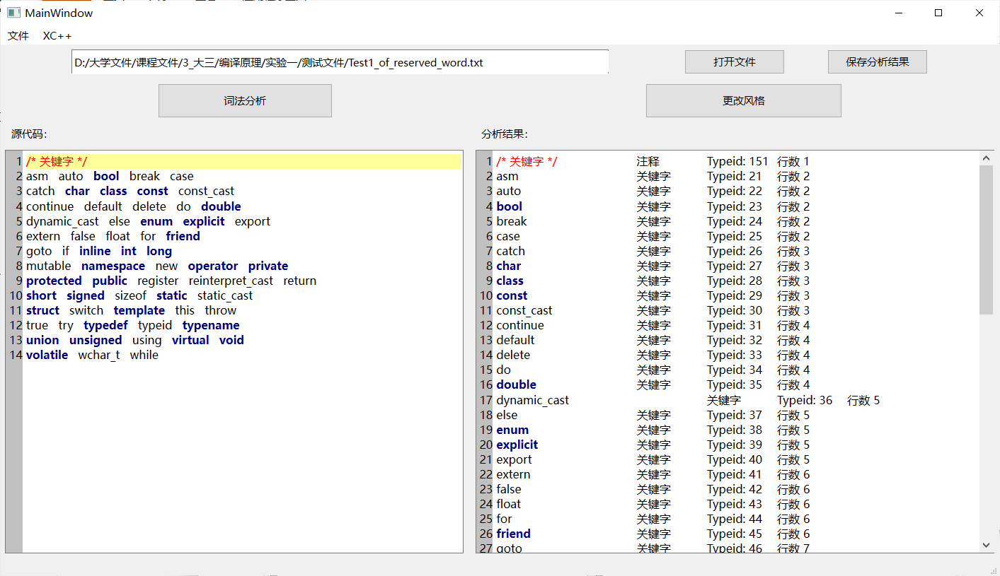
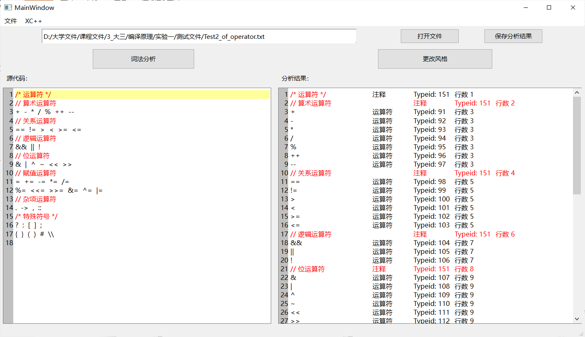

    
     
    
图1. 测试样例程序

    
     
    
图2. 测试关键字

    
     
    
图3. 测试运算符

    
     
    
图4. 测试数字

    
     
    
图5. 测试标识符

    
     
    
图6. 测试字符串与字符常量

    
     
    
图7. 测试较复杂头文件

    
     
    
图8. 测试XC++风格

根据上图可以看出，该程序基本能完成识别正常的C++Token，也能将C++风格代码转换成XC++风格代码。但是该程序无法识别 `#include<iostream>` 中的 < 与 >， 将他们识别成了运算符小于号，对于这一点目前还没想到太好的解决方法。

