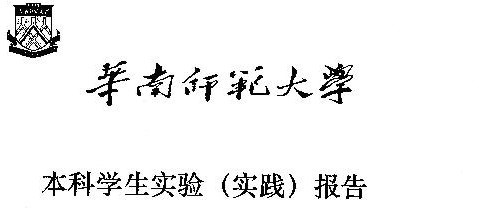

<div class="cover" style="page-break-after:always;font-family:宋体;width:100%;height:100%;border:none;margin: 0 auto;text-align:center;">
    <div style="width:60%;margin: 0 auto;height:0;padding-bottom:10%;">
        </br>
    </div>
    </br></br></br>
    <div style="width:60%;margin: 0 auto;height:0;padding-bottom:40%;">
        
	</div>
    </br></br></br>
    <span style="font-family:华文黑体Bold;text-align:center;font-size:20pt;margin: 10pt auto;line-height:30pt;">院　　系：计算机学院</span>
    <p style="text-align:center;font-size:14pt;margin: 0 auto">  </p>
    </br>
    </br>
    <table style="border:0;text-align:center;width:72%;font-family:仿宋;font-size:14px; margin: 0 auto;">
    <tbody style="font-family:宋体;font-size:12pt;">
    	<tr style="font-weight:normal;"> 
    		<td style="width:20%;text-align:right;">实验课程：</td>
    		<td style="width:40%;font-weight:normal;border-bottom: 1px solid;text-align:center;font-family:华文仿宋">编译原理 </td>     </tr>
        <tr style="font-weight:normal;"> 
    		<td style="width:20%;text-align:right;">实验项目：</td>
    		<td style="width:40%;font-weight:normal;border-bottom: 1px solid;text-align:center;font-family:华文仿宋">C++单词拼装器 </td>     </tr>
        <tr style="font-weight:normal;"> 
    		<td style="width:20%;text-align:right;">指导老师：</td>
    		<td style="width:40%;font-weight:normal;border-bottom: 1px solid;text-align:center;font-family:华文仿宋">黄煜廉 </td>     </tr>
        <tr style="font-weight:normal;"> 
    		<td style="width:20%;text-align:right;">开课时间：</td>
    		<td style="width:40%;font-weight:normal;border-bottom: 1px solid;text-align:center;font-family:华文仿宋">2023~2024年度第一学期 </td>     </tr>
        <tr style="font-weight:normal;"> 
    		<td style="width:20%;text-align:right;">专　　业：</td>
    		<td style="width:40%;font-weight:normal;border-bottom: 1px solid;text-align:center;font-family:华文仿宋">计算机科学与技术 </td>     </tr>
    	<tr style="font-weight:normal;"> 
    		<td style="width:20%;text-align:right;">班　　级：</td>
    		<td style="width:40%;font-weight:normal;border-bottom: 1px solid;text-align:center;font-family:华文仿宋">计算机科学与技术3班 </td>     </tr>
    </tbody>              
    </table>
</div>
<!-- 注释语句：导出PDF时会在这里分页 -->

# 华 南 师 范 大 学 实 验 报 告


<div class="cover" style="font-family:宋体;width:100%;height:100%;border:none;margin: 0 auto;text-align:center;">
    <table style="border:1;text-align:center;width:100%;font-family:仿宋;font-size:12px; margin: 0 auto;border:0;">
    <tbody style="font-family:宋体;font-size:12pt;">
    	<tr style="font-weight:normal;"> 
    		<td style="width:20%">学生姓名</td>
    		<td style="width:30%;font-weight:normal;border-bottom: 1px solid;text-align:center;">卢泓钢</td> 
    		<td style="width:20%">学号</td>
    		<td style="width:30%;font-weight:normal;border-bottom: 1px solid;text-align:center;">20212131096</td>     </tr>
        <tr style="font-weight:normal;"> 
    		<td style="width:20%">专业</td>
    		<td style="width:30%;font-weight:normal;border-bottom: 1px solid;text-align:center;">计算机科学与技术</td> 
    		<td style="width:20%">年级、班级</td>
    		<td style="width:30%;font-weight:normal;border-bottom: 1px solid;text-align:center;">2021级计科3班</td>     </tr>
        <tr style="font-weight:normal;"> 
    		<td style="width:20%">课程名称</td>
    		<td style="width:30%;font-weight:normal;border-bottom: 1px solid;text-align:center;">编译原理</td> 
    		<td style="width:20%">实验项目</td>
    		<td style="width:30%;font-weight:normal;border-bottom: 1px solid;text-align:center;">C++单词拼装器</td>     </tr>
        <tr style="font-weight:normal;"> 
    		<td style="width:20%">实验类型</td>
    		<td style="width:30%;font-weight:normal;border-bottom: 1px solid;text-align:center;">综合</td> 
    		<td style="width:20%">实验时间</td>
    		<td style="width:30%;font-weight:normal;border-bottom: 1px solid;text-align:center;">2023 年 9 月 28 日</td>     </tr>
        <tr style="font-weight:normal;"> 
    		<td style="width:20%">实验指导老师</td>
    		<td style="width:30%;font-weight:normal;border-bottom: 1px solid;text-align:center;">黄煜廉</td> 
    		<td style="width:20%">实验评分</td>
    		<td style="width:30%;font-weight:normal;border-bottom: 1px solid;text-align:center;"></td>     </tr>
    </tbody>              
    </table>
</div>


[toc]


## 实验内容

**必做内容**

1. 把C++源代码中的各类单词（记号）进行拼装分类。
          C++语言包含了几种类型的单词（记号）：标识符，关键字，数（包括整数、浮点数），字符串、注释、特殊符号（分界符）和运算符号等【详细的单词类别及拼装规则见另外的文件说明】。
2. 要求应用程序应为Windows界面。
3. 打开一个C++源文件，列出所有可以拼装的单词（记号）。
4. 应该书写完善的软件设计文档。

**选做内容**

预编译系统的实现----打造具有个人风格的XC++语言（单词替换）

1. 描述具有风格的XC++的单词有哪些，分别对应原C++的是哪些单词。
2. 实现这个单词替换方案。
3. 需要按上述1,2的内容书写相应的设计文档。


## 实验目的

利用 C++ 编程实现编译原理中词法扫描分析器的功能。


## 实验文档

### 实验文档：基于Qt的C++单词拼装器

### 引言

本实验旨在开发一个基于Qt的文件解析器，能够将文件内容解析为一系列Token，并提供可选的转换为XC++风格的功能。文件解析器在软件工程规范下开发，具有高度的可维护性和扩展性。

### 设计思路

#### Token类型与结构

我们使用了`TokenType`来表示 Token 的类型，并使用`struct Token`来存储Token的信息，包括类型、值和所在行数。这种设计的好处在于可以轻松扩展 Token 的类型，以适应不同语言的解析需求。

```cpp
using TokenType = int;	// Token 的类型

struct Token {
    TokenType type;		// Token 的类型
    string val;			// Token 的值
    int line;			// Token 所在行数
};
```

#### Parser类

Parser类是核心组件，负责将文件内容解析为Token流。它具有以下关键方法：

- `void analyse()`: 该方法负责分析文件内容，并将解析得到的Token保存在一个`vector<Token>`中。
- `string print()`: 这个方法将已分析的Token流转换为文本输出，包括Token的值、类型和所在行数。
- `string changeToX()`: 可选功能，将原始C++风格的代码转换为XC++风格的代码，利用了预先定义的字符映射字典`my_style`。

上述关键方法的实现离不开该类的工具函数函数：

- `void init()`: 该方法负责初始化 Token 映射表 `mp` 与XC++风格字符映射字典`my_style`。
- `Token parse()`: 该方法根据文本 text 与当前遍历指针 pc 解析出一个 Token。
- `string getIntorFloat()`: 该方法解析出一个整数或浮点数。
- `string getNum()`: 该方法解析出一个数字。

#### 系统的总体结构

该系统由`main`函数开始，通过`MainWindow`类打开主窗口，主窗口内通过qt自带的ui组件进行布局，并通过信号与槽将按钮与实现的功能进行连接。当按下词法分析时，系统创建一个Parser类对象，对文本框内的文本进行词法分析(详见mainwindow.cpp文件内的`on_styleButton_clicked()`函数)；当按下更改风格按钮时，系统创建一个Parser类对象，对文本框内的C++文件转换成XC++风格的文件(详见mainwindow.cpp文件内的`on_XCInstruction_triggered()`函数)。codeeditor与highlighter文件分别实现文本框功能与代码高亮功能。

### 实现细节

#### Token映射表初始化

在Parser类的构造函数中，我们初始化了Token映射表`mp`和XC++风格字符映射字典`my_style`。这些映射表用于将原始代码中的关键字和运算符映射到对应的Token类型或XC++风格字符。

#### Token解析过程

Parser类的`parse`方法实现了Token的解析过程。它根据当前的字符和上下文，识别不同类型的Token，包括关键字、标识符、数字、字符串、字符常量、运算符和特殊符号。

以下展示核心方法 `parse` 的基本实现：

```cpp
Token Parser::parse() {
    Token token;
    string s;
    if (text[pc] 是数字（包括+-）)
        token.type = mp["#NUMBER"];
        token.val = getNum();
        token.line = cur_line;
    } else if (isalpha(text[pc]) || text[pc] == '_') {	// 标识符或关键字
        读入字符直到不满足条件，判断是否为标识符
    } else if (text[pc] == '\'') { // 字符常量
        读入字符直到遇到'
    } else if (text[pc] == '"') {	// 字符串
        读入字符直到遇到"
    } else if (text[pc] == '/' && text[pc+1] == '/') {	// 单行注释
        读入字符直到遇到 //
    } else if (text[pc] == '/' && text[pc+1] == '*') {	// 多行注释
        读入字符直到遇到 */
    } else {	// 运算符或其他符号
    	switch (text[pc]) { // 分别处理每种运算符
            case '+':
                ...
        }
	}
	return token;
}
```

#### 文件解析

Parser类的`analyse`方法实现了文件的解析过程。它遍历输入字符串，跳过空白字符和注释，然后调用`parse`方法来识别和保存Token。解析过程中还会记录Token所在的行数，以便在错误处理时提供更多信息。

#### 转换为XC++风格

Parser类的`changeToX`方法实现了将C++风格转换为XC++风格。代码逻辑与`analyse`方法类似，解析出Token后判断是否可转换为XC++风格，并将其用字符串保存。

### 测试

我对该项目进行了多方面的测试，包括测试各类数字的识别，标识符的识别，关键字的识别等。具体测试结果如下图：

<center>
    
    <br>
    <div style="color:orange; border-bottom: 1px solid #d9d9d9;
    display: inline-block;
    color: #999;
    padding: 2px;">图1. 测试样例程序</div>
</center>

<center>
    
    <br>
    <div style="color:orange; border-bottom: 1px solid #d9d9d9;
    display: inline-block;
    color: #999;
    padding: 2px;">图2. 测试关键字</div>
</center>

<center>
    
    <br>
    <div style="color:orange; border-bottom: 1px solid #d9d9d9;
    display: inline-block;
    color: #999;
    padding: 2px;">图3. 测试运算符</div>
</center>


更多测试样例请看Testfile文件夹内的测试文档。


## 实验总结

在本次实验中，我学会了如何有效地表示Token的数据结构，并通过遍历字符串将里面的单词识别出来，这些单词包括关键字、标识符、运算符和特殊符号等。我还使用了面向对象的思想，将代码解析器抽象为一个对象，这样能使得程序结构更加清晰。

在项目中，我还学会了使用Qt框架来开发GUI应用程序，处理文件操作和字符串处理。通过不断学习新技术，我能够不断提高自己的技能水平，这将对我的未来项目和职业发展能产生积极影响。


## 参考文献

[《Qt 学习之路 2》目录 - DevBean Tech World](https://www.devbean.net/2012/08/qt-study-road-2-catelog/)
