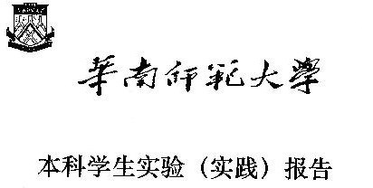
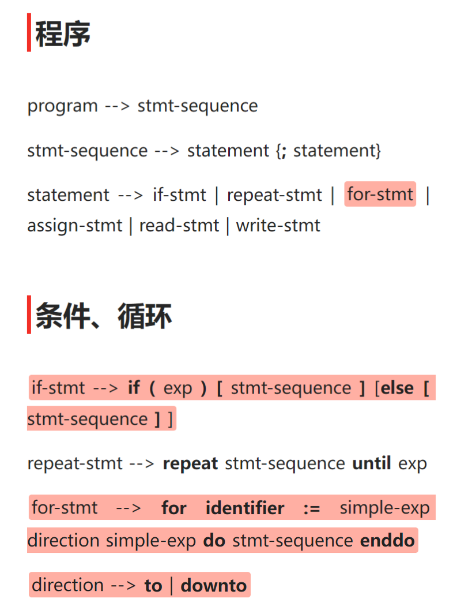
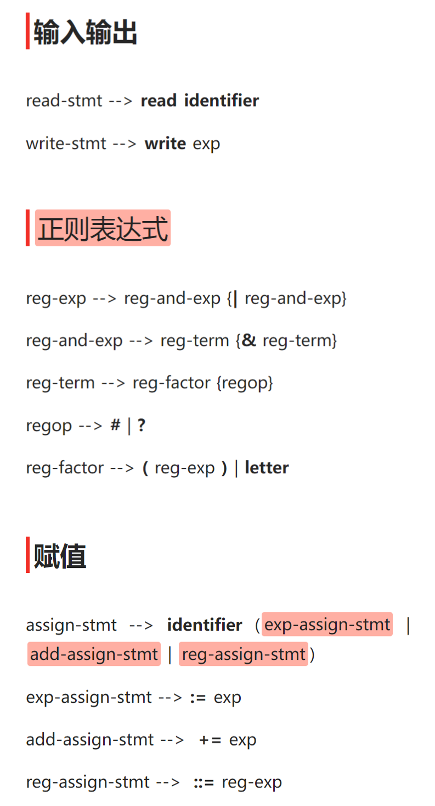
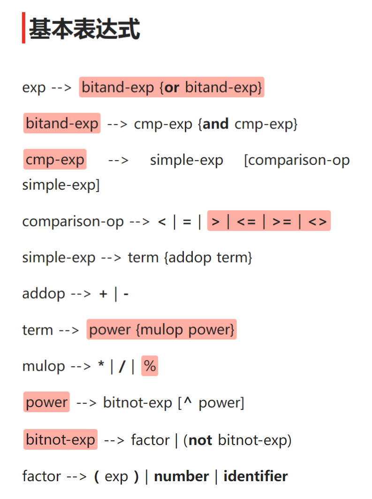

<div class="cover" style="page-break-after:always;font-family:宋体;width:100%;height:100%;border:none;margin: 0 auto;text-align:center;">
    <div style="width:60%;margin: 0 auto;height:0;padding-bottom:10%;">
        </br>
    </div>
    </br></br></br>
    <div style="width:60%;margin: 0 auto;height:0;padding-bottom:40%;">
        
	</div>
    </br></br></br>
    <span style="font-family:华文黑体Bold;text-align:center;font-size:20pt;margin: 10pt auto;line-height:30pt;">院　　系：计算机学院</span>
    <p style="text-align:center;font-size:14pt;margin: 0 auto">  </p>
    </br>
    </br>
    <table style="border:0;text-align:center;width:72%;font-family:仿宋;font-size:14px; margin: 0 auto;">
    <tbody style="font-family:宋体;font-size:12pt;">
    	<tr style="font-weight:normal;"> 
    		<td style="width:20%;text-align:right;">实验课程：</td>
    		<td style="width:40%;font-weight:normal;border-bottom: 1px solid;text-align:center;font-family:华文仿宋">编译原理 </td>     </tr>
        <tr style="font-weight:normal;"> 
    		<td style="width:20%;text-align:right;">实验项目：</td>
    		<td style="width:40%;font-weight:normal;border-bottom: 1px solid;text-align:center;font-family:华文仿宋">TINY扩充语言的语法树生成 </td>     </tr>
        <tr style="font-weight:normal;"> 
    		<td style="width:20%;text-align:right;">指导老师：</td>
    		<td style="width:40%;font-weight:normal;border-bottom: 1px solid;text-align:center;font-family:华文仿宋">黄煜廉 </td>     </tr>
        <tr style="font-weight:normal;"> 
    		<td style="width:20%;text-align:right;">开课时间：</td>
    		<td style="width:40%;font-weight:normal;border-bottom: 1px solid;text-align:center;font-family:华文仿宋">2023~2024年度第一学期 </td>     </tr>
        <tr style="font-weight:normal;"> 
    		<td style="width:20%;text-align:right;">专　　业：</td>
    		<td style="width:40%;font-weight:normal;border-bottom: 1px solid;text-align:center;font-family:华文仿宋">计算机科学与技术 </td>     </tr>
    	<tr style="font-weight:normal;"> 
    		<td style="width:20%;text-align:right;">班　　级：</td>
    		<td style="width:40%;font-weight:normal;border-bottom: 1px solid;text-align:center;font-family:华文仿宋">计算机科学与技术3班 </td>     </tr>
    </tbody>              
    </table>
</br></br></br></br></br></br></br></br></br>
<footer>
	<p style="text-align:center;font-size:21pt;margin: 0 auto;font-family:华文新魏;"> <strong>华南师范大学教务处</strong> </p>
</footer> 
</div>


<!-- 注释语句：导出PDF时会在这里分页 -->

# 华 南 师 范 大 学 实 验 报 告


<div class="cover" style="font-family:宋体;width:100%;height:100%;border:none;margin: 0 auto;text-align:center;">
    <table style="border:1;text-align:center;width:100%;font-family:仿宋;font-size:12px; margin: 0 auto;border:0;">
    <tbody style="font-family:宋体;font-size:12pt;">
    	<tr style="font-weight:normal;"> 
    		<td style="width:20%">学生姓名</td>
    		<td style="width:30%;font-weight:normal;border-bottom: 1px solid;text-align:center;">卢泓钢</td> 
    		<td style="width:20%">学号</td>
    		<td style="width:30%;font-weight:normal;border-bottom: 1px solid;text-align:center;">20212131096</td>     </tr>
        <tr style="font-weight:normal;"> 
    		<td style="width:20%">专业</td>
    		<td style="width:30%;font-weight:normal;border-bottom: 1px solid;text-align:center;">计算机科学与技术</td> 
    		<td style="width:20%">年级、班级</td>
    		<td style="width:30%;font-weight:normal;border-bottom: 1px solid;text-align:center;">2021级计科3班</td>     </tr>
        <tr style="font-weight:normal;"> 
    		<td style="width:20%">课程名称</td>
    		<td style="width:30%;font-weight:normal;border-bottom: 1px solid;text-align:center;">编译原理</td> 
    		<td style="width:20%">实验项目</td>
    		<td style="width:30%;font-weight:normal;border-bottom: 1px solid;text-align:center;">TINY扩充语言的语法树生成</td>     </tr>
        <tr style="font-weight:normal;"> 
    		<td style="width:20%">实验类型</td>
    		<td style="width:30%;font-weight:normal;border-bottom: 1px solid;text-align:center;">综合</td> 
    		<td style="width:20%">实验时间</td>
    		<td style="width:30%;font-weight:normal;border-bottom: 1px solid;text-align:center;">2023 年 11 月 27 日</td>     </tr>
        <tr style="font-weight:normal;"> 
    		<td style="width:20%">实验指导老师</td>
    		<td style="width:30%;font-weight:normal;border-bottom: 1px solid;text-align:center;">黄煜廉</td> 
    		<td style="width:20%">实验评分</td>
    		<td style="width:30%;font-weight:normal;border-bottom: 1px solid;text-align:center;"></td>     </tr>
    </tbody>              
    </table>
</div>


[toc]

## 实验内容

为Tiny语言扩充语法

1. 实现改写书写格式的新if语句；
2. 增加for循环；
3. 扩充算术表达式的运算符号：+= 加法赋值运算符号（类似于C语言的+=）、求余%、乘方^，
4. 扩充扩充比较运算符号：=（等于），>(大于)、<=(小于等于)、>=(大于等于)、<>(不等于)等运算符号，
5. 增加正则表达式，其支持的运算符号有：  或(|)  、连接(&)、闭包(#)、括号( ) 、可选运算符号（？）和基本正则表达式。 
6. 增加位运算表达式，其支持的位运算符号有 and(与)、or（或）、 not（非）。


对应的语法规则：

1. 把TINY语言原有的if语句书写格式
    if_stmt-->if exp then stmt-sequence end | if exp then stmt-sequence else stmt-sequence end 
    改写为：
    if_stmt-->if(exp) stmt-sequence else stmt-sequence | if(exp) stmt-sequence

2. for语句的语法规则：
   1. for-stmt-->for identifier:=simple-exp  to  simple-exp  do  stmt-sequence enddo    步长递增1
   2. for-stmt-->for identifier:=simple-exp  downto  simple-exp  do  stmt-sequence enddo    步长递减1
3. += 加法赋值运算符号、求余%、乘方^等运算符号的文法规则请自行组织。
4. =（等于），>(大于)、<=(小于等于)、>=(大于等于)、<>(不等于)等运算符号的文法规则请自行组织。
5. 为tiny语言增加一种新的表达式——正则表达式，其支持的运算符号有：  或(|)  、连接(&)、闭包(#)、括号( ) 、可选运算符号（？）和基本正则表达式，对应的文法规则请自行组织。
6. 为tiny语言增加一种新的语句，ID:=正则表达式  
7. 为tiny语言增加一种新的表达式——位运算表达式，其支持的运算符号有  and(与)  、or (或)、非(not)。
8. 为tiny语言增加一种新的语句，ID:=位运算表达式  
9. 为了实现以上的扩充或改写功能，还需要注意对原tiny语言的文法规则做一些相应的改造处理。 


## 实验目的

为 Tiny 语言扩展语法，并生成语法树


## 实验文档

### 实验文档：基于Qt的TINY扩充语言的语法树生成程序

### 引言

本实验旨在开发一个基于Qt的TINY扩充语言的语法树生成程序，该软件能够根据扩展后的 Tiny 源程序，生成语法树。

### 设计思路

首先根据扩展 Tiny 语言的语法规则，写出文法规则

<center>
    
    <br>
    <div style="color:orange; border-bottom: 1px solid #d9d9d9;
    display: inline-block;
    color: #999;
    padding: 2px;">文法规则1</div>
</center>

<center>
    
    <br>
    <div style="color:orange; border-bottom: 1px solid #d9d9d9;
    display: inline-block;
    color: #999;
    padding: 2px;">文法规则2</div>
</center>

<center>
    
    <br>
    <div style="color:orange; border-bottom: 1px solid #d9d9d9;
    display: inline-block;
    color: #999;
    padding: 2px;">文法规则3</div>
</center>


文法规则中加粗的符号为终结符号，高亮处为新增的语法规则。

对于 if 语句，老师要求的语法规则为 if_stmt --> if(exp) stmt-sequence else stmt-sequence | if(exp) stmt-sequence, 但是这样的语法规则会导致 if 语句的嵌套出现歧义，例子如下：

```
y = 1;
if (x >= 0)
if (x <= 10)
y = 2
else
y = 3
```

对于以上代码，根据以上语法规则，我们无法确定 else 语句是属于哪个 if 语句的，有以下两种情况：

```
{情况一}
y = 1;
if (x >= 0)
    if (x <= 10)
        y = 2
else
    y = 3

{情况二}
y = 1;
if (x >= 0)
    if (x <= 10)
        y = 2
    else
        y = 3
```

因此我将其改写为  if-stmt --> **if** **(** exp **)** **[** stmt-sequence **]** [**else** **[** stmt-sequence **]** ] 用终结符号方括号（[ ]）括住语句序列，这样就能解决嵌套歧义的问题。

对于正则表达式的赋值，若按照老师的语法规则 ID:=正则表达式 ，会导致正则表达式的赋值与算术表达式的赋值出现歧义，例子如下：

```
exp := a;
reg := a
```

单一字符 a 既可以是算术表达式，也可以是正则表达式，无法判断当前赋值语句是正则表达式赋值还是普通表达式赋值，因此我将正则表达式的赋值改写为 ID ::= 正则表达式，这样就能解决赋值歧义的问题。再将三种赋值语句提取左公因式，得到上图中的赋值语句。

对于各类表达式的优先级，我参考了 C++ 优先级顺序，具体如下：

| 优先级 | 运算符 | 结合性 |
| :----: | :----: | :----: |
|   1    |   not    |  右结合  |
|   2    |   ^    |  右结合  |
|   3    |   * / %    |  左结合  |
|   4    |   + -    |  左结合  |
|   5    |   < <= > >= <> =    |  无结合  |
|   6    |   and    |  左结合  |
|   7    |   or    |  左结合  |

根据该优先级顺序可以得到上图中各类表达式的文法规则。


然后，根据文法规则，设计语法分析程序，使用递归下降法进行语法分析，生成语法树。


### 实现细节

#### 添加新 Token

对于扩展的 Tiny 语言，我们需要新增一些 Token 类型，如下：

```c++
/* globals.h */
typedef enum
/* book-keeping tokens */
{
  ENDFILE, ERROR,
  /* reserved words */
  IF, THEN, ELSE, END, REPEAT, UNTIL, READ, WRITE, 
  FOR, TO, DO, DOWNTO, ENDDO,
  NOT, AND, OR,           // 非与或
  /* multicharacter tokens */
  ID, NUM,
  /* special symbols */
  ASSIGN, ADD_ASSIGN, REG_ASSIGN, // 赋值
  EQ,     // 等于
  LT, GT, LE, GE, NE,     // 小于，大于，小于等于，大于等于，不等于
  PLUS, MINUS, TIMES, OVER, MOD, POWER, // 加减乘除求余乘方
  LPAREN, RPAREN,           // 左右括号
  LBRACKET, RBRACKET,       // 左右中括号
  SEMI,                      // 分号
  CONCAT, REGOR, CLOSURE, OPTIONAL  // 正则表达式操作
} TokenType;
```

对于新增的 Token 类型，我们需要完善输出函数，如下：

```c++
/* util.cpp */
void printToken(TokenType token, const char *tokenString) {
    switch (token) {
    /* 仅列出主要添加项，其他省略 */
    case LT: fprintf(listing, "<\n"); break;
    case EQ: fprintf(listing, "=\n"); break;
    case GT: fprintf(listing, ">\n"); break;
    case LE: fprintf(listing, "<=\n"); break;
    case GE: fprintf(listing, ">=\n"); break;
    case NE: fprintf(listing, "<>\n"); break;

    case NOT: fprintf(listing, "not\n"); break;
    case AND: fprintf(listing, "and\n"); break;
    case OR: fprintf(listing, "or\n"); break;

    default: /* should never happen */
        fprintf(listing, "Unknown token: %d\n", token);
    }
}
```

我们需要还需要为新增的 Token 类型添加对应的原字符串，以及补充 getToken 函数，如下：

```c++
#define MAXRESERVED 16

/* states in scanner DFA */
typedef enum {
    START,      // 开始
    INASSIGN,   // 赋值
    INADD,      // 加或加法赋值
    INCOMMENT,  // 注释
    INNUM,      // 数字
    INID,       // 标识符
    INLNE,      // 小于等于或不等于
    INGE,      // 大于等于
    DONE        // 结束
}
StateType;

/* scan.cpp */
static struct {
    char *str;
    TokenType tok;
} reservedWords[MAXRESERVED]
= { {"if",IF},{"then",THEN},{"else",ELSE},{"end",END},
   {"repeat",REPEAT},{"until",UNTIL},{"read",READ},
   {"write",WRITE},{"not",NOT},{"and",AND},{"or",OR},
   {"for",FOR},{"to",TO},{"do",DO},{"downto",DOWNTO},{"enddo",ENDDO} };

TokenType getToken(void) {  /* index for storing into tokenString */
    int tokenStringIndex = 0;
    /* holds current token to be returned */
    TokenType currentToken;
    /* current state - always begins at START */
    StateType state = START;
    /* flag to indicate save to tokenString */
    int save;
    while (state != DONE) {
        /* 仅展示主要改动 */
        int c = getNextChar();
        save = TRUE;
        switch (state) {
        case START:
            if (isdigit(c))
                state = INNUM;
            else if (c == '+')  // 新增一个 DFA 状态，处理 + 号与 += 的区别
                state = INADD;
            else {
                state = DONE;
                switch (c) {
                case : /* 新增的 % 与 ^ */
                case : /* 新增的正则表达式符号 & | # ? */
                default:
                    currentToken = ERROR;
                    break;
                }
            }
            break;
        case INADD:
            state = DONE;
            if (c == '=')
                currentToken = ADD_ASSIGN;
            else {
                ungetNextChar();
                save = FALSE;
                currentToken = PLUS;
            }
            break;
        case INLNE:         // 小于等于或不等于  
            state = DONE;
            if (c == '=')
                currentToken = LE;
            else if (c == '>')
                currentToken = NE;
            else {
                ungetNextChar();
                save = FALSE;
                currentToken = LT;
            }
            break;
        case : /* 大于等于或大于同理 */
        case INASSIGN:  
            state = DONE;
            if (c == '=')   // 普通的表达式赋值
                currentToken = ASSIGN;
            else if (c == ':') {    // 若当前符号还是冒号，则需要再看下一个符号，若为 = 则为正则表达式赋值，否则出错
                char nc = getNextChar();
                if (nc == '=') {
                    currentToken = REG_ASSIGN;
                } else {
                    ungetNextChar();
                    goto FALL;
                }
            } else { /* backup in the input */
FALL:           ungetNextChar();
                save = FALSE;
                currentToken = ERROR;
            }
            break;
    }
    return currentToken;
} /* end getToken */
```

对于多字符 Token 的获取, 我们需要参考 Tiny 语言原有实现，为 scanner DFA 添加新的状态。以获取大于等于号的Token为例，要新建一个 DFA 状态 INGE，在当前遍历字符为 > 时，进入 INGE 状态，若下一个字符为 = 则返回 GE，否则返回 GT。


#### 实现新的语法规则

文法规则及匹配所对应文件为 prase.cpp 和 prase.h，其中 prase.cpp 中的函数为递归下降法的实现，prase.h 中的函数为语法分析程序的接口。

**if 语句**

```c++
TreeNode *if_stmt(void) {
    TreeNode *t = newStmtNode(IfK);
    match(IF);
    match(LPAREN);  // 匹配左括号
    if (t != NULL) t->child[0] = exp();
    match(RPAREN);  // 匹配右括号

    match(LBRACKET);    // 匹配左中括号
    if (t != NULL) t->child[1] = stmt_sequence();
    match(RBRACKET);    // 匹配右中括号

    if (token == ELSE) {
        match(ELSE);
        match(LBRACKET);
        if (t != NULL) t->child[2] = stmt_sequence();
        match(RBRACKET);
    }
    return t;
}
```

按照 if 语句的文法规则，非终结符号递归调用，终结符号匹配 Token，并返回对应语法树的根节点。

**for 语句**

```c++
TreeNode *for_stmt(void) {
    TreeNode *t = newStmtNode(ForK);
    match(FOR);
    if (t != NULL) {
        TreeNode *p = newStmtNode(AssignK);
        if ((p != NULL) && (token == ID))
            p->attr.name = copyString(tokenString);
        match(ID);
        if (token == ASSIGN) {
            match(ASSIGN);
            if (p != NULL) p->child[0] = simple_exp();
        }
        t->child[0] = p;    // 第一个孩子存放赋值语句
    }
    if (token == TO) {
        match(TO);
        t->attr.op = TO;
    } else if (token == DOWNTO) {
        match(DOWNTO);
        t->attr.op = DOWNTO;
    }
    if (t != NULL) t->child[1] = simple_exp();  // 第二个孩子存放表达式
    match(DO);
    if (t != NULL) t->child[2] = stmt_sequence();   // 第三个孩子存放语句序列
    match(ENDDO);
    return t;
}
```

对于 for 语句的两种形式 to 与 downto，我选择将这个信息保留在该语句根节点的 attr.op 中，这样在生成语法树时，就能根据 attr.op 的值来判断是 to 还是 downto。

**表达式**

表达式的文法规则较多，这里仅展示部分文法规则的实现。

```c++
/* 对于右结合的乘方运算符 ^，需要使用右递归来实现，这样才能保证运算符的结合顺序。 */
TreeNode *power(void) {
    TreeNode *t = bitnot_exp();
    if (token == POWER) {
        TreeNode *p = newExpNode(OpK);
        if (p != NULL) {
            p->child[0] = t;
            p->attr.op = token;
            t = p;
            match(token);
            p->child[1] = power();  // 右递归实现右结合运算符
        }
    }
    return t;
}

TreeNode *bitnot_exp(void) {
    if (token != NOT) {
        return factor();
    }
    TreeNode *p = newExpNode(OpK);
    if (p != NULL) {
        p->attr.op = token;
        match(token);
        p->child[0] = bitnot_exp(); // 用递归实现右结合单目运算符
    }
    return p;
}
```

**赋值语句**

```c++
TreeNode *assign_stmt(void) {
    TreeNode *t = newStmtNode(AssignK);
    if ((t != NULL) && (token == ID))
        t->attr.name = copyString(tokenString);
     match(ID);
    switch (token) {
    case ASSIGN:        // 赋值语句
        match(ASSIGN);
        if (t != NULL) t->child[0] = exp();
        break;
    case ADD_ASSIGN:    // 加法赋值语句
        t->kind.stmt = Add_AssignK;
        match(ADD_ASSIGN);
        if (t != NULL) t->child[0] = exp();
        break;
    case REG_ASSIGN:    // 正则赋值语句
        t->kind.stmt = Reg_AssignK;
        match(REG_ASSIGN);
        if (t != NULL) t->child[0] = reg_exp();
        break;
    }
    return t;
}
```


#### 生成语法树

参考 Tiny 语言原有的语法树生成程序，可以很容易地在 Qt 生成语法树，具体实现如下：

```c++
void MainWindow::createTreeItem(TreeNode *tree, QTreeWidgetItem *parent)
{
    // 参考printTree函数，将语法树转换为QTreeWidgetItem
    while (tree != NULL) {
        QTreeWidgetItem *item = new QTreeWidgetItem(parent);
        item->setChildIndicatorPolicy(QTreeWidgetItem::DontShowIndicatorWhenChildless);
        switch (tree->nodekind) {
        case StmtK:
            switch (tree->kind.stmt) {
            case IfK:
                item->setText(0, "If");
                break;
            case RepeatK:
                item->setText(0, "Repeat");
                break;
            case ForK: {
                QString s = "For: ";
                if (tree->attr.op == TO) {
                    s += "upto";
                } else if (tree->attr.op == DOWNTO) {
                    s += "downto";
                }
                item->setText(0, s);
                break;
            }
            case AssignK:
                item->setText(0, "Assign to: " + QString(tree->attr.name));
                break;
            case Add_AssignK:
                item->setText(0, "Add_Assign to: " + QString(tree->attr.name));
                break;
            case Reg_AssignK:
                item->setText(0, "Reg_Assign to: " + QString(tree->attr.name));
                break;
            case ReadK:
                item->setText(0, "Read: " + QString(tree->attr.name));
                break;
            case WriteK:
                item->setText(0, "Write");
                break;
            default:
                break;
            }
            break;
        case ExpK:
            switch (tree->kind.exp) {
            case OpK:
                item->setText(0, "Op: " + Token2QString(tree->attr.op));
                break;
            case ConstK:
                item->setText(0, "Const: " + QString::number(tree->attr.val));
                break;
            case IdK:
                item->setText(0, "Id: " + QString(tree->attr.name));
                break;
            default:
                break;
            }
            break;
        default:
            break;
        }
        for (int i = 0;i < MAXCHILDREN;i++) {
            if (tree->child[i] != NULL) {
                createTreeItem(tree->child[i], item);
            }
        }
        tree = tree->sibling;
    }
}
```


### 测试

#### 测试一

测试以下 Tiny 程序：

```
{ Sample program
  in TINY language -
  computes factorial
}
read x; { input an integer }
if  (0<x)  { don't compute if x <= 0 } [
  for  fact := x downto 1 do 
    fact := fact * x;
  enddo
  write fact;  { output factorial of x }
]
```

测试结果如下图：

<center>
    
    <br>
    <div style="color:orange; border-bottom: 1px solid #d9d9d9;
    display: inline-block;
    color: #999;
    padding: 2px;">图1-1. 测试1-1</div>
</center>

可见该程序存在语法错误，第 8、10 行多了分号，而第 9 行缺少分号，因此生成了错误的语法树。

将错误修改后再次测试，结果如下图：

<center>
    
    <br>
    <div style="color:orange; border-bottom: 1px solid #d9d9d9;
    display: inline-block;
    color: #999;
    padding: 2px;">图1-2. 测试1-2</div>
</center>

此时能生成正确的语法树。


#### 测试二

测试以下 Tiny 文件：

```
{ Sample program
  in TINY language -
  computes factorial
}
read x; { input an integer }

if  (x>0) { don't compute if x <= 0 } [
  fact := 1;
  repeat
    fact := fact * x;
    x := x - 1
  until x = 0;
  write fact  { output factorial of x }
]
```

测试结果如下图：

<center>
    
    <br>
    <div style="color:orange; border-bottom: 1px solid #d9d9d9;
    display: inline-block;
    color: #999;
    padding: 2px;">图2. 测试2</div>
</center>

该程序语法正确，可以生成正确的语法树。

更多测试样例请看Testfile文件夹内的测试文档。


## 实验总结

本次实验主要涉及对Tiny语言进行语法扩展和语法树生成的工作。在实验中，我首先根据实验要求，对Tiny语言进行了语法扩展，包括新增if语句的改写、for语句的添加、新增算术表达式和比较运算符、正则表达式和位运算表达式等。为了实现这些扩展，我需要对原有的Tiny语言的文法规则进行调整和新增，以适应新的语法需求。

在语法扩展的基础上，我使用了Qt框架来开发一个基于Qt的TINY扩充语言的语法树生成程序。在程序中，我实现扩展后的 Tiny 语言词法分析器和语法分析器，对输入的Tiny源程序进行扫描和解析，生成对应的语法树。在语法分析的过程中，使用递归下降法，根据文法规则递归地构建语法树的节点。

实验过程中遇到的主要困难包括对语法规则的理解和实现，特别是对于新增的语法要求，需要仔细考虑如何调整原有的文法规则以及如何在语法分析中处理新增的语法结构。在调试过程中，通过输出中间结果和调试信息，逐步发现和解决了一些语法错误和逻辑问题。

通过完成本次实验，我深入理解了编译原理中的语法分析和语法树生成的过程，掌握了递归下降法的实现方法。我还强化了使用Qt框架来开发GUI应用程序的技能，能更轻松地开发基于qt的GUI程序。


## 参考文献

[《Qt 学习之路 2》目录 - DevBean Tech World](https://www.devbean.net/2012/08/qt-study-road-2-catelog/)

黄煜廉老师的ppt