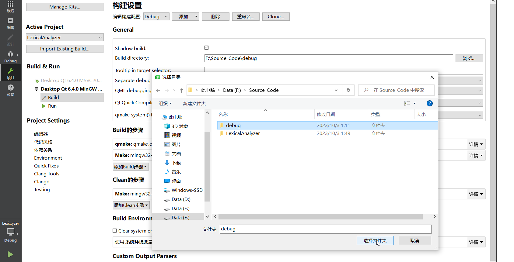

**注意！**源代码路径不能有中文

该程序使用 Qt Creator 8.0.1 (Community) 的 Desktop Qt 6.4.0 MinGW 64-bit 进行编译，使用 qmake 进行构建，需要用到 C++17

按以下步骤进行：

1. 打开 Qt Creator 8.0.1 (Community) 
2. `Ctrl+O` 打开 LexicalAnalyzer 文件夹内 LexicalAnalyzer.pro 文件
3. 点击右侧项目，选择Build directory路径为该文件夹下的debug文件夹
4. 点击左下角绿色三角形即可编译运行

