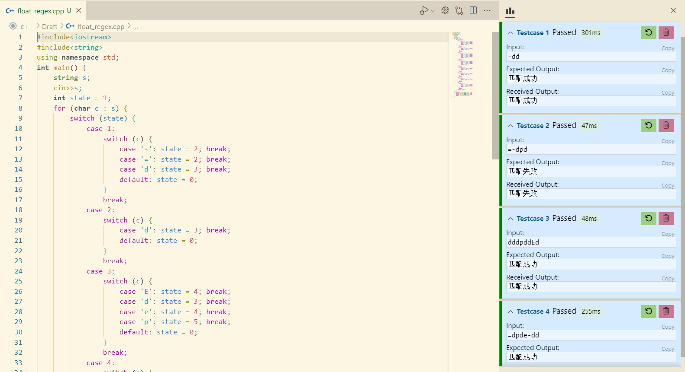

# 测试报告

## 分析错误原因

对于给出的正则表达式 **((+|-)?dd\*)(.dd\*)?((E|e)((+|-)?dd*))?** 提交上去的程序运行出错闪退，原因有两点：

- 完成了实验二的选做内容正闭包（+），导致程序无法正确区分字符'+'与正闭包运算符（+）
- 在对原正则表达式添加显式的连接符号时使用了小数点（.），导致无法正确识别题目中带小数点的正则表达式

## 修改正则表达式

根据以上两点错误原因，我将以上正则表达式进行以下两点修改：

- 将原表达式中的（+）修改为（=）
- 将原表达式中的（.）修改为（p）

修改后的正则表达式为 **((=|-)?dd\*)(pdd\*)?((E|e)((=|-)?dd*))?** ，修改后程序能正常运行。

## 运行结果及分析

程序运行结果如下图：

### **生成NFA**

每个字符在NFA中需要两个状态表示，选择运算（|）与闭包运算（*）均需要额外的两个状态来表示，可选运算（？）不需要添加额外的状态。该正则表达式总共有 13 个字符，3 个选择运算，3 个闭包运算，需要的状态数为 $(13+3+3) \times 2 = 38$ 个，而程序生成的NFA正好包含 38 个状态，可以初步判断程序生成了正确的NFA。

### **生成DFA**

程序能将NFA的等价节点用集合表示并输出。

### **生成最小化DFA**

根据生成的最小DFA，画出状态转换图如下：

与浮点数的DFA图作对比：

可以看出是一致的，因此表明程序生成了正确的最小化DFA。

### 生成词法分析程序

将其保存为 cpp 文件，测试运行：

可以看出程序能正确地对浮点数进行识别。