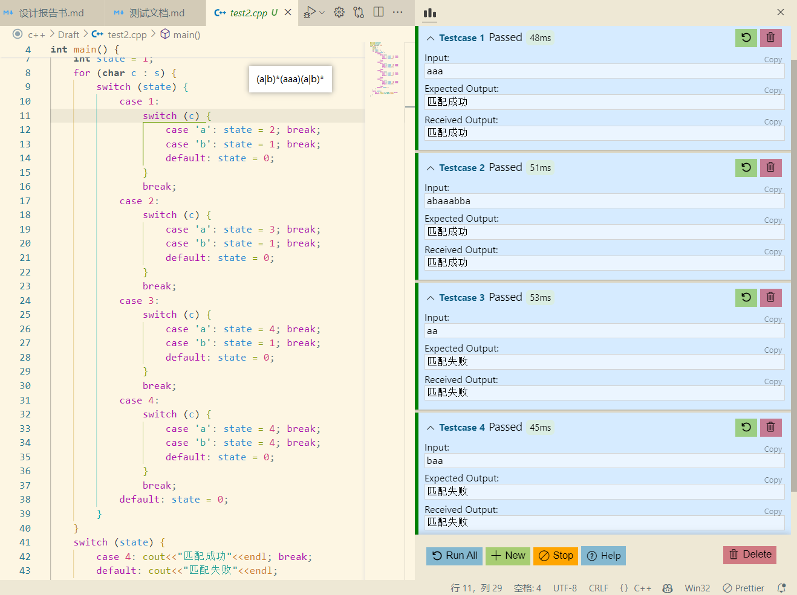

## 测试1

选择正则表达式 `a(a|b)*` 作为测试用例测试结果如下：

    
     
    
图1. 正则表达式转NFA

    
     
    
图2. NFA转DFA

    
     
    
图3. 最小化DFA

    
     
    
图4. 生成词法分析程序

    
     
    
图5. 测试生成的词法分析程序

可看出该程序能生成正确的对正则表达式 `a(a|b)*` 的词法分析程序

## 测试2

选择正则表达式 `(a|b)*(aaa)(a|b)*` 作为测试用例测试结果如下：

    
     
    
图6(1). 正则表达式转NFA(1)

    
     
    
图6(2). 正则表达式转NFA(2)

    
     
    
图6(3). 正则表达式转NFA(3)

    
     
    
图7. NFA转DFA

    
     
    
图8. 最小化DFA

    
     
    
图9. 生成词法分析程序

    
     
    
图10(1). 测试生成的词法分析程序(1)

    
     
    
图10(2). 测试生成的词法分析程序(2)

可看出该程序能生成正确的对正则表达式 `(a|b)*(aaa)(a|b)*` 的词法分析程序

## 测试3

选择正则表达式 `(a|b)?d+(pd+)?(e(a|b)?d+)?` 作为测试用例测试结果如下：

    
     
    
图11. 正则表达式转NFA

    
     
    
图12. NFA转DFA

    
     
    
图13. 最小化DFA

    
     
    
图14. 生成词法分析程序

    
     
    
图15. 测试生成的词法分析程序

该正则表达式为类浮点数匹配的正则表达式，浮点数的DFA如下图：

根据图13生成的最小DFA，画出状态转换图，可以发现跟浮点数的DFA图高度一致，表明该程序对正则表达式 `(a|b)?d+(pd+)?(e(a|b)?d+)?` 生成了正确的最小DFA

根据图15可看出该程序能生成正确的对正则表达式 `(a|b)?d+(pd+)?(e(a|b)?d+)?` 的词法分析程序