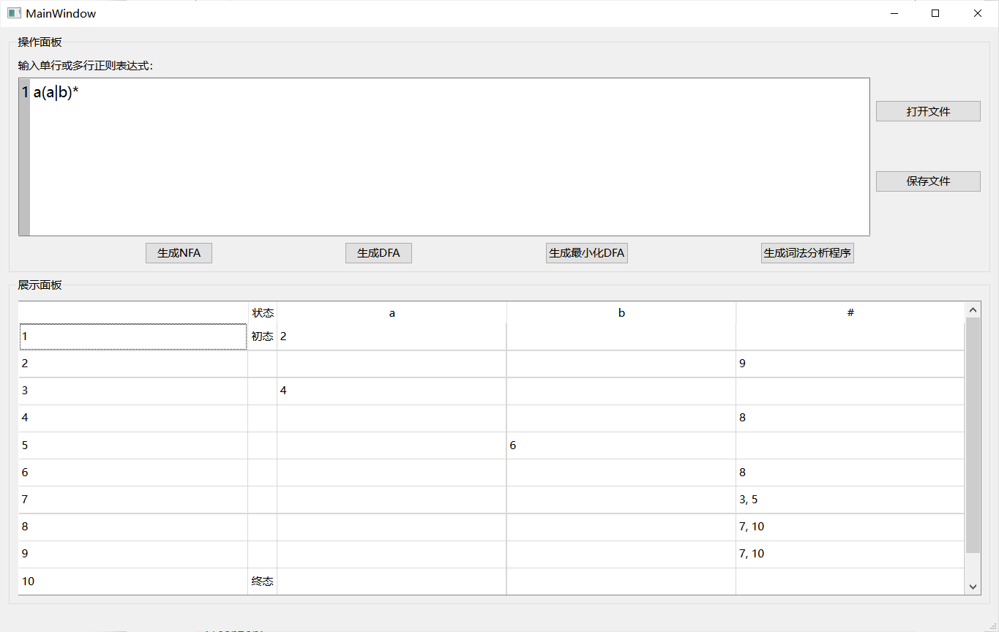

<div class="cover" style="page-break-after:always;font-family:宋体;width:100%;height:100%;border:none;margin: 0 auto;text-align:center;">
    <div style="width:60%;margin: 0 auto;height:0;padding-bottom:10%;">
        </br>
    </div>
    </br></br></br>
    <div style="width:60%;margin: 0 auto;height:0;padding-bottom:40%;">
        
	</div>
    </br></br></br>
    <span style="font-family:华文黑体Bold;text-align:center;font-size:20pt;margin: 10pt auto;line-height:30pt;">院　　系：计算机学院</span>
    <p style="text-align:center;font-size:14pt;margin: 0 auto">  </p>
    </br>
    </br>
    <table style="border:0;text-align:center;width:72%;font-family:仿宋;font-size:14px; margin: 0 auto;">
    <tbody style="font-family:宋体;font-size:12pt;">
    	<tr style="font-weight:normal;"> 
    		<td style="width:20%;text-align:right;">实验课程：</td>
    		<td style="width:40%;font-weight:normal;border-bottom: 1px solid;text-align:center;font-family:华文仿宋">编译原理 </td>     </tr>
        <tr style="font-weight:normal;"> 
    		<td style="width:20%;text-align:right;">实验项目：</td>
    		<td style="width:40%;font-weight:normal;border-bottom: 1px solid;text-align:center;font-family:华文仿宋">XLEX-词法自动生成器 </td>     </tr>
        <tr style="font-weight:normal;"> 
    		<td style="width:20%;text-align:right;">指导老师：</td>
    		<td style="width:40%;font-weight:normal;border-bottom: 1px solid;text-align:center;font-family:华文仿宋">黄煜廉 </td>     </tr>
        <tr style="font-weight:normal;"> 
    		<td style="width:20%;text-align:right;">开课时间：</td>
    		<td style="width:40%;font-weight:normal;border-bottom: 1px solid;text-align:center;font-family:华文仿宋">2023~2024年度第一学期 </td>     </tr>
        <tr style="font-weight:normal;"> 
    		<td style="width:20%;text-align:right;">专　　业：</td>
    		<td style="width:40%;font-weight:normal;border-bottom: 1px solid;text-align:center;font-family:华文仿宋">计算机科学与技术 </td>     </tr>
    	<tr style="font-weight:normal;"> 
    		<td style="width:20%;text-align:right;">班　　级：</td>
    		<td style="width:40%;font-weight:normal;border-bottom: 1px solid;text-align:center;font-family:华文仿宋">计算机科学与技术3班 </td>     </tr>
    </tbody>              
    </table>
</br></br></br></br></br></br></br></br></br>
<footer>
	<p style="text-align:center;font-size:21pt;margin: 0 auto;font-family:华文新魏;"> <strong>华南师范大学教务处</strong> </p>
</footer> 
</div>


<!-- 注释语句：导出PDF时会在这里分页 -->

# 华 南 师 范 大 学 实 验 报 告


<div class="cover" style="font-family:宋体;width:100%;height:100%;border:none;margin: 0 auto;text-align:center;">
    <table style="border:1;text-align:center;width:100%;font-family:仿宋;font-size:12px; margin: 0 auto;border:0;">
    <tbody style="font-family:宋体;font-size:12pt;">
    	<tr style="font-weight:normal;"> 
    		<td style="width:20%">学生姓名</td>
    		<td style="width:30%;font-weight:normal;border-bottom: 1px solid;text-align:center;">卢泓钢</td> 
    		<td style="width:20%">学号</td>
    		<td style="width:30%;font-weight:normal;border-bottom: 1px solid;text-align:center;">20212131096</td>     </tr>
        <tr style="font-weight:normal;"> 
    		<td style="width:20%">专业</td>
    		<td style="width:30%;font-weight:normal;border-bottom: 1px solid;text-align:center;">计算机科学与技术</td> 
    		<td style="width:20%">年级、班级</td>
    		<td style="width:30%;font-weight:normal;border-bottom: 1px solid;text-align:center;">2021级计科3班</td>     </tr>
        <tr style="font-weight:normal;"> 
    		<td style="width:20%">课程名称</td>
    		<td style="width:30%;font-weight:normal;border-bottom: 1px solid;text-align:center;">编译原理</td> 
    		<td style="width:20%">实验项目</td>
    		<td style="width:30%;font-weight:normal;border-bottom: 1px solid;text-align:center;">XLEX-词法自动生成器</td>     </tr>
        <tr style="font-weight:normal;"> 
    		<td style="width:20%">实验类型</td>
    		<td style="width:30%;font-weight:normal;border-bottom: 1px solid;text-align:center;">综合</td> 
    		<td style="width:20%">实验时间</td>
    		<td style="width:30%;font-weight:normal;border-bottom: 1px solid;text-align:center;">2023 年 9 月 28 日</td>     </tr>
        <tr style="font-weight:normal;"> 
    		<td style="width:20%">实验指导老师</td>
    		<td style="width:30%;font-weight:normal;border-bottom: 1px solid;text-align:center;">黄煜廉</td> 
    		<td style="width:20%">实验评分</td>
    		<td style="width:30%;font-weight:normal;border-bottom: 1px solid;text-align:center;"></td>     </tr>
    </tbody>              
    </table>
</div>


[toc]

## 实验内容

设计一个应用软件，以实现将正则表达式-->NFA--->DFA-->DFA最小化-->词法分析程序

**必做内容**

 （1）正则表达式应该支持单个字符，运算符号有： 连接、选择（|）、闭包（*）、括号（）、可选（?  ）
 （2）要提供一个源程序编辑界面，让用户输入一行（一个）或多行（多个）正则表达式（可保存、打开正则表达式文件）
 （3）需要提供窗口以便用户可以查看转换得到的NFA（用状态转换表呈现即可）
 （4）需要提供窗口以便用户可以查看转换得到的DFA（用状态转换表呈现即可）
 （5）需要提供窗口以便用户可以查看转换得到的最小化DFA（用状态转换表呈现即可）
 （6）需要提供窗口以便用户可以查看转换得到的词法分析程序（该分析程序需要用C/C++语言描述）
 （7）用户界面应该是windows界面
 （9）应该书写完善的软件文档


**选做实验**
  （1）扩充正则表达式的运算符号，如   [ ] 、 正闭包（+） 等。


## 实验目的

设计一个应用软件，以实现将正则表达式-->NFA--->DFA-->DFA最小化-->词法分析程序


## 实验文档

### 实验文档：基于Qt的C++ XLEX-词法自动生成器

### 引言

本实验旨在开发一个基于Qt的XLEX-词法自动生成器，该软件能够将用户输入的正则表达式转化为词法分析程序。具体步骤包括从正则表达式构建非确定性有限自动机（NFA），将NFA 转换为确定性有限自动机（DFA），并对DFA 进行最小化处理，最后生成相应的词法分析程序。文件解析器在软件工程规范下开发，具有高度的可维护性和扩展性。

### 数据结构与设计思路

核心过程由 xlexgenerator.h 中的 XLEXGenerator 类来实现，简要声明如下：

```cpp
class XLEXGenerator {
public:
    XLEXGenerator() {}
    XLEXGenerator(string reg) {regExp = reg;}
    void init();	// 初始化
    void reg2NFA(); // Thompson构造法
    void NFA2DFA();	// 子集构造法
    void minimizeDFA();	// 最小化DFA
    void DFA2XLEX();	// DFA转换为词法分析程序

public:
    /* get成员变量 / set成员变量 （略） */

private:
    /* 成员变量 */
    /* reg to NFA */
    int idNFA = 1;			// 节点编号
    int start;		// 起始状态
    int end;		// 终止状态
    string regExp;	// 正则表达式
    set<char> charset;	// 字符集
    map<int, map<char, set<int>>> NFA;	// NFA

    /* NFA to DFA */
    int idDFA = 1;	// DFA节点编号
    map<int, map<char, int>> DFA;		// DFA
    map<set<int>, int> stateMap;			// 状态集合映射
    map<int, set<int>> stateMapReverse;		// 状态映射集合
    set<int> DFAendSet;	// DFA终止状态集合

    /* 最小化 DFA */
    int idMinDFA = 1;	// 最小化DFA节点编号
    map<int, map<char, int>> minDFA;	// 最小化DFA
    set<int> minDFAendSet;  // minDFA终止状态集合

    /* DFA to 词法分析程序 */
    string xlex;    // 词法分析程序

private:
    /* 工具函数 （略） */
};
```

public成员函数`void reg2NFA()`使用Thompson构造法，实现正则表达式到NFA的转换；`void NFA2DFA()`使用子集构造法，实现NFA到DFA的转换；`void minimizeDFA()`使用逐一合并状态的方法，实现DFA到最小化DFA的转换；`void DFA2XLEX()`实现DFA到词法分析程序的转换。而函数`void init()`用于初始化参数，并根据传入的正则表达式，依次调用上述函数，实现正则表达式到词法分析程序的转换。

**主要的数据结构**

- 使用`map<int, map<char, set<int>>>`的数据结构存储NFA，表示NFA状态u通过字符c能到达的状态集合s，即`NFA[u][c] = s`。
- 使用`map<int, map<char, int>>`的数据结构存储DFA，表示DFA状态u通过字符c能到达的状态v，即`DFA[u][c] = v`。
- 使用`map<int, map<char, int>>`的数据结构存储最小化DFA，表示最小化DFA状态u通过字符c能到达的状态v，即`minDFA[u][c] = v`。
- 使用`map<set<int>, int>`的数据结构存储NFA状态集合与DFA状态的映射，即`stateMap[u] = v`表示NFA状态集合u对应的DFA状态为v。
- 使用`map<int, set<int>>`的数据结构存储DFA状态与NFA状态集合的映射，即`stateMapReverse[v] = u`表示DFA状态v对应的NFA状态集合为u。
- 使用`set<int>`的数据结构存储DFA终止状态集合，即`DFAendSet`。
- 使用`set<int>`的数据结构存储最小化DFA终止状态集合，即`minDFAendSet`。


软件的总体结构可以分为以下模块：

- 用户界面模块：提供正则表达式输入、编辑、打开和保存的功能。
- 编译模块：包括正则表达式到 NFA 转换、NFA 到 DFA 转换、DFA 最小化以及词法分析程序生成。
- 输出模块：展示 NFA、DFA、最小化 DFA 的状态转换表，以及生成的词法分析程序。


### 实现细节

#### 正则表达式到NFA

函数`void reg2NFA()`使用Thompson构造法，实现正则表达式到NFA的转换。Thompson构造法的核心思想是通过双栈操作，将正则表达式转换为NFA。一个是操作符栈，一个是操作数栈。其中操作数栈存储的是当前已经构造好的NFA的初态与终态。

为了简化代码，我实现了工具函数`pii binOp(char op, pii a, pii b)`和`pii monOp(char op, pii a)`，用于处理双目运算符和单目运算符：

```cpp
pii XLEXGenerator::binOp(char op, pii a, pii b) {
    switch (op) {
        case '.': return opConnect(a, b);
        case '|': return opUnion(a, b);
    } return {};
}

pii XLEXGenerator::monOp(char op, pii a) {
    switch (op) {
        case '*': return opClosure(a);
        case '?': return opOption(a);
        case '+': return opPosClosure(a);
    } return {};
}
```

这两个函数根据不同的操作符分别调用不同的工具函数，以函数`pii opUnion(pii a, pii b)`为例，其实现如下：

```cpp  
// 并操作，创建两个新的节点，将其连接到a和b的起始状态，将a和b的终止状态连接到另一个新的节点
pii XLEXGenerator::opUnion(pii a, pii b) {
    NFA[idNFA]['#'].insert(a.first);
    NFA[idNFA++]['#'].insert(b.first);
    NFA[a.second]['#'].insert(idNFA);
    NFA[b.second]['#'].insert(idNFA++);
    return {idNFA - 2, idNFA - 1};
}
```

我对正则表达式**扩充**了正闭包 (+) 运算，添加函数 `pii opPosClosure(pii a)`，其实现如下：

```cpp
// 正闭包操作，创建两个新的节点，将其连接到a的起始状态，将a的终止状态连接到另一个新的节点，将a的终止状态连接到a的起始状态
pii XLEXGenerator::opPosClosure(pii a) {
    NFA[idNFA]['#'].insert(a.first);
    NFA[a.second]['#'].insert(a.first);
    NFA[a.second]['#'].insert(idNFA + 1);
    return {idNFA++, idNFA++};
}
```

对于正则表达式中的连接运算，因为在原始正则表达式中没有专门的连接运算符，所以需要在正则表达式中添加连接符，即将正则表达式中的`ab`转换为`a.b`。函数`void addConnector()`用于为正则表达式添加连接符，具体实现如下：

```cpp
void XLEXGenerator::addConnector() {
    for (int i = 0; i < regExp.length() - 1; i++) {
        char it = regExp[i], next = regExp[i + 1];
        if (it == '(' || it == '|')
            continue;
        if (next == ')' || next == '|' || next == '*' || next == '+' || next == '?')
            continue;
        regExp.insert(i + 1, ".");
        i++;
    }
}
```

综上所述，函数`void reg2NFA()`具体实现如下：

```cpp
// 使用Thompson构造法，通过双栈操作，将正则表达式转换为NFA
void XLEXGenerator::reg2NFA() {
    addConnector();	// 为正则表达式添加连接符
    stack<pii> nodeStack;	// 操作数栈 <起始状态, 终止状态>
    stack<char> opStack;	// 操作符栈
    for (int i = 0; i < regExp.length(); i++) {
        char it = regExp[i];
        if (it == '(') {
            opStack.push(it);
        } else if (it == ')') {	// 遇到右括号，弹出操作符栈中的操作符，直到遇到左括号
            while (opStack.top() != '(') {
                /* 将运算符与操作数取出来运算 */
            }
            opStack.pop();	// 弹出左括号
        } else if (it == '*' || it == '.' || it == '|' || it == '?' || it == '+') {	// 遇到操作符，弹出操作符栈中优先级大于等于当前操作符的操作符
            while (!opStack.empty() && priority(opStack.top()) >= priority(it)) {   // 弹出优先级大于等于当前操作符的操作符
                /* 将运算符与操作数取出来运算 */
            }
            opStack.push(it);	// 将当前操作符压入操作符栈
        } else {	// 遇到操作数，创建一个新的节点，将其压入操作数栈
            NFA[idNFA][it].insert(idNFA + 1);
            nodeStack.push({idNFA++, idNFA++});
            charset.insert(it);
        }
    }
    while (!opStack.empty()) {	// 将操作符栈中剩余的操作符弹出
        /* 将运算符与操作数取出来运算 */
    }
    // 获取起始状态和终止状态
    start = nodeStack.top().first;
    end = nodeStack.top().second;
}
```

#### NFA到DFA

函数`void NFA2DFA()`使用子集构造法，从 NFA 的起始状态出发，构建 DFA 状态和状态转移表。具体步骤包括：

- 获取NFA中起始状态的闭包作为DFA的起始状态。
- 使用广度优先搜索（BFS）来构建 DFA 状态和状态转移表。
- 遍历字符集，获取状态集合通过字符转换后的状态集合的闭包。
- 构建 DFA 终止状态集合。

具体实现如下：

```cpp
// 使用子集构造法，将NFA转换为DFA
void XLEXGenerator::NFA2DFA() {
    set<int> startSet = getClosure({start});    // 获取起始状态的闭包
    stateMap[startSet] = idDFA;
    stateMapReverse[idDFA++] = startSet;
    queue<set<int>> q;  // BFS队列
    q.push(startSet);
    while (!q.empty()) {    // BFS
        set<int> u = q.front(); q.pop();
        for (char c : charset) {
            auto v = getClosure(move(u, c));    // 获取状态集合u通过字符c转换后的状态集合的闭包
            if (v.empty()) continue;        // 空集不处理
            if (!stateMap.count(v)) {
                stateMap[v] = idDFA;    // 添加新状态
                stateMapReverse[idDFA++] = v;
                q.push(v);
            }
            DFA[stateMap[u]][c] = stateMap[v];    // 添加状态转换
        }
    }
    for (auto& [k, v]:stateMapReverse) {   // 获取终止状态集合
        if (v.count(end)) {
            DFAendSet.insert(k);
        }
    }
}
```

#### DFA到最小化DFA

函数`void minimizeDFA()`使用逐一合并状态的方法，实现DFA到最小化DFA的转换，通过并查集识别等价状态并合并它们。具体步骤包括：

- 使用并查集识别等价状态。
- 合并等价状态，构建最小化 DFA 状态和状态转移表。
- 获取最小化 DFA 终止状态集合。

使用二重循环遍历DFA中的每一对状态，如果两个状态通过字符转移后的状态在同一个集合中，表明这两个状态是等价的，可以进行合并。使用并查集来维护等价关系，如果DFA中两个状态等价，则将两个状态在并查集中merge起来，最后将并查集中的每个集合作为最小化DFA的一个状态。

并查集的实现如下：

```cpp
struct DSU {
    vector<int> fa, siz;
    DSU(int n) : fa(n), siz(n, 1) { iota(fa.begin(), fa.end(), 0); }
    int find(int x) {
        return fa[x] == x? x:(fa[x] = find(fa[x]));
    }
    bool same(int x, int y) { return find(x) == find(y); }
    bool merge(int x, int y) {
        x = find(x); y = find(y);
        if (x == y) return false;
        if (x > y) swap(x, y);
        siz[x] += siz[y];
        fa[y] = x;
        return true;
    }
    int size(int x) { return siz[find(x)]; }
};
```

具体实现如下：

```cpp
// 使用合并的方法，将DFA最小化
void XLEXGenerator::minimizeDFA() {
    DSU dsu(idDFA);
    map<int, int> DFA2minDFA;
    for (int i=1;i<idDFA;i++) {
        if (i != dsu.find(i))   // 如果已经合并则不处理
            continue;
        for (int j=1;j<idDFA;j++) {
            if (dsu.same(i, j)) continue;
            // 终态只能与终态合并，非终态只能与非终态合并
            if (DFAendSet.count(i) ^ DFAendSet.count(j))
                continue;
            bool flag = true;
            for (char c : charset) {
                if (!DFA[i].count(c) && !DFA[j].count(c))    // 如果两个状态都不存在转移则不处理
                    continue;
                if (DFA[i].count(c) ^ DFA[j].count(c)) { // 如果两个状态只有一个存在转移则不合并
                    flag = false;
                    break;
                }
                if (!dsu.same(DFA[i][c], DFA[j][c])) { // 如果两个状态转移后的状态不在同一个集合则不合并
                    flag = false;
                    break;
                }
            }
            if (flag) { // 合并两个状态
                dsu.merge(i, j);
            }
        }
    }
    auto move = [&](set<int> states, char c) {
        set<int> res;
        for (auto state : states) {
            if (!DFA.count(state)) continue;
            if (!DFA[state].count(c)) continue;
            res.insert(DFA[state][c]);
        }
        return res;
    };
    map<int, int> DS2minS;
    // 划分出来的集合
    map<int, set<int>> partitionSet;
    for (int i=1;i<idDFA;i++) {
        if (i == dsu.find(i)) { // 根节点
            partitionSet[idMinDFA] = {i};
            DS2minS[i] = idMinDFA++;
        } else {
            partitionSet[DS2minS[dsu.find(i)]].insert(i);
        }
    }
    for (auto& [node, states]:partitionSet) {
        for (char c : charset) {
            set<int> next = move(states, c);
            if (next.empty()) continue;
            int nextNode = DS2minS[dsu.find(*next.begin())];
            minDFA[node][c] = nextNode;
        }
        // 记录终态
        for (auto state : states) {
            if (DFAendSet.count(state)) {
                minDFAendSet.insert(node);
                break;
            }
        }
    }
}
```

#### DFA到词法分析程序

函数`void DFA2XLEX()`实现minDFA到词法分析程序的转换，具体步骤包括：

- 使用状态机设计，根据当前状态和输入字符进行状态转移。
- 生成 C++ 代码，根据最小化 DFA 设计状态转移。
- 输出匹配成功或失败。

使用一个变量保持当前的状态，并将转换写成一个双层嵌套的case语句，其中第1个case语句测试当前的状态，嵌套着的第2层测试输入字特及所给状态。

具体实现如下：

```cpp
// 根据最小化DFA生成c++词法分析程序
void XLEXGenerator::DFA2XLEX() {
    stringstream ss;
    ss << "#include<iostream>\n";
    ss << "#include<string>\n";
    ss << "using namespace std;\n";
    ss << "int main() {\n";
    ss << "    string s;\n";
    ss << "    cin>>s;\n";
    ss << "    int state = 1;\n";
    ss << "    for (char c : s) {\n";
    ss << "        switch (state) {\n";
    for (auto& [node, ma]:minDFA) {
        ss << "            case " << node << ":\n";
        ss << "                switch (c) {\n";
        for (auto& [k, v]:ma) {
            ss << "                    case '" << k << "': state = " << v << "; break;\n";
        }
        ss << "                    default: state = 0;\n";
        ss << "                }\n";
        ss << "                break;\n";
    }
    ss << "            default: state = 0;\n";
    ss << "        }\n";
    ss << "    }\n";
    ss << "    switch (state) {\n";
    for (auto it : minDFAendSet) {
        ss << "        case " << it << ": cout<<\"匹配成功\"<<endl; break;\n";
    }
    ss << "        default: cout<<\"匹配失败\"<<endl;\n";
    ss << "    }\n";
    ss << "}\n";
    xlex = ss.str();
}
```


### 测试

选择正则表达式 `a(a|b)*` 作为测试用例测试结果如下：

<center>
    
    <br>
    <div style="color:orange; border-bottom: 1px solid #d9d9d9;
    display: inline-block;
    color: #999;
    padding: 2px;">图1. 正则表达式转NFA</div>
</center>

<center>
    
    <br>
    <div style="color:orange; border-bottom: 1px solid #d9d9d9;
    display: inline-block;
    color: #999;
    padding: 2px;">图2. NFA转DFA</div>
</center>

<center>
    
    <br>
    <div style="color:orange; border-bottom: 1px solid #d9d9d9;
    display: inline-block;
    color: #999;
    padding: 2px;">图3. 最小化DFA</div>
</center>

<center>
    
    <br>
    <div style="color:orange; border-bottom: 1px solid #d9d9d9;
    display: inline-block;
    color: #999;
    padding: 2px;">图4. 生成词法分析程序</div>
</center>

<center>
    
    <br>
    <div style="color:orange; border-bottom: 1px solid #d9d9d9;
    display: inline-block;
    color: #999;
    padding: 2px;">图5. 测试生成的词法分析程序</div>
</center>

通过该测试，可以看出该程序能完成将正则表达式-->NFA--->DFA-->DFA最小化-->词法分析程序的全过程。

更多测试样例请看Testfile文件夹内的测试文档。


## 实验总结

这次实验让我深入理解了从正则表达式到词法分析程序的转换过程。首先，通过Thompson构造法，使用双栈操作，将正则表达式转换为NFA。这个步骤中，最关键的是需要对每个正则表达式里的每个操作符所对应的操作构建NFA中的状态和状态之间的转移关系。接着，使用子集构造法将NFA转换为DFA，去除NFA中的空转移与一对多映射。

同时我学习了如何对DFA进行最小化处理，通过状态的等价性来合并状态，减少了DFA中的状态数量，能使词法分析程序更为简洁和高效。最后，需要将最小化DFA转换为词法分析程序，通过状态机设计，根据当前状态和输入字符进行状态转移，生成 C++ 代码，输出匹配成功或失败。

在项目中，我还强化了使用Qt框架来开发GUI应用程序的技能，能更轻松地开发基于qt的GUI程序。


## 参考文献

[《Qt 学习之路 2》目录 - DevBean Tech World](https://www.devbean.net/2012/08/qt-study-road-2-catelog/)

[【精选】NFA到DFA的转化](https://blog.csdn.net/weixin_43655282/article/details/108963761)

黄煜廉老师的ppt